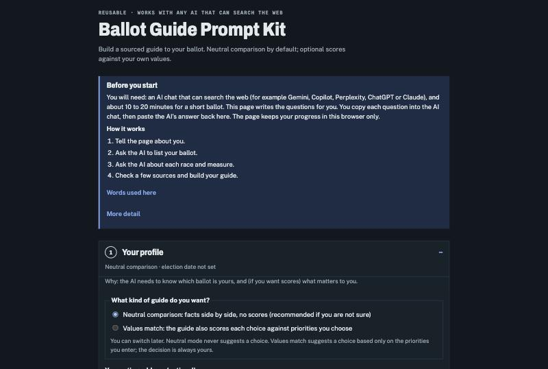

# Ballot Guide

**Build your own sourced guide to any US ballot, with the AI chat you already use.** It finds the exact races and measures on your ballot, first checks what candidates have *done*, then what they say, fact-checks ballot measures, and links every claim to a source you can open. Free, open source, and not affiliated with any party, campaign or election office.

### [→ Start in your browser](https://tperkowitz-tech.github.io/ballot-guide/) (no install, no account)

## How it works

1. **Tell the page about you.** Your address finds your exact ballot. Optionally, list the issues that matter to you.
2. **Ask the AI to list your ballot.** The page writes the question; you paste it into any AI chat with web search (Gemini, Copilot, Perplexity, ChatGPT, Claude) and paste the answer back.
3. **Ask about each race and measure.** One short chat per item keeps the AI focused. An optional double-check has a second chat verify each answer against its sources.
4. **Spot-check a few sources and build your guide.** The page picks links for you to open.

A short ballot takes about 10 to 20 minutes.

**When to use it:** once your ballot or voters' pamphlet arrives (usually 2 to 6 weeks before Election Day), when candidate lists are final and most questionnaires and donor reports are out. In the final week, re-check close races and the candidate list for withdrawals, late donor reports and news. Avoid waiting until Election Day: there is no time left to check sources.

## Is it partisan?

No. Party labels, party platforms and party endorsements are never used as evidence. By default you get a **neutral side-by-side comparison** with no scores. If you choose **values match**, choices are scored only against the priorities *you* enter, and every piece of evidence is shown so you can disagree with it. See [how the scores work](SCORING.md).

## Privacy

The web page keeps your progress only in your own browser, on your own device. Your address goes only into the question that looks up your ballot (and that question's optional double-check), which you paste into an AI chat yourself; that chat service may keep it. The page collects nothing about you, uses no cookies or tracking, and loads nothing from other sites; GitHub, which hosts it, sees visitors' IP addresses like any website host. Press "Start over" to erase everything saved in your browser. Full details are in the [privacy section of the web kit](https://tperkowitz-tech.github.io/ballot-guide/#privacy).

## Good to know

- It supports your own research; it does not replace it. AI can be wrong, so open the sources, especially for close calls.
- Dates, deadlines and places to vote come only from your official election office ([vote.org](https://www.vote.org) can point you there).
- Tried it? [Tell us where it worked](TESTED.md).
- Found a wrong fact or a broken source? [Report it](https://github.com/tperkowitz-tech/ballot-guide/issues/new/choose).

## Use it inside an AI app

| You use | How |
|---|---|
| Any AI chat | The [web kit](https://tperkowitz-tech.github.io/ballot-guide/) or the plain-text [`PROMPT-KIT.md`](PROMPT-KIT.md) |
| Claude apps | Download `ballot-guide.skill` from the [latest release](https://github.com/tperkowitz-tech/ballot-guide/releases/latest) and upload it in Claude's Skills settings |
| Claude Code | Unzip the release file into `~/.claude/skills/` |
| Codex | Copy the [`ballot-guide/`](ballot-guide/) folder to `~/.agents/skills/`, restart Codex, then ask `Use $ballot-guide to research my ballot.` |

## For contributors

The skill lives in [`ballot-guide/`](ballot-guide/); the web kit is generated from its prompts, and [`delegation.md`](ballot-guide/references/delegation.md) covers optional sub-agent research. See [CONTRIBUTING.md](CONTRIBUTING.md) for how to edit, test (`python3 tools/check.py`) and release.

This tool builds on other people's work; see [CREDITS.md](CREDITS.md). MIT licensed. See [LICENSE](LICENSE).
